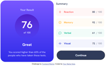
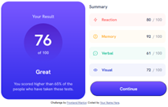
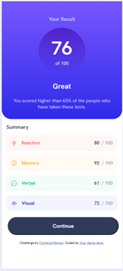

# Frontend Mentor - Results summary component solution

This is a solution to the [Results summary component challenge on Frontend Mentor](https://www.frontendmentor.io/challenges/results-summary-component-CE_K6s0maV). Frontend Mentor challenges help you improve your coding skills by building realistic projects. 

## Overview

### The challenge

Users should be able to:

- View the optimal layout for the interface depending on their device's screen size
- See hover and focus states for all interactive elements on the page
- Use the local JSON data to dynamically populate the content

### Screenshot

### Links

- Solution URL: [my solution](https://github.com/toshirokubota/result-summary-component)
- Live Site URL: [live site of my solution](https://toshirokubota.github.io/result-summary-component/)

## My process

### Built with

- Semantic HTML5 markup
- CSS custom properties
- Flexbox
- Mobile-first workflow
The content of the web page is populated dynamically from a JSON data file (However, the current version has JSON data pasted inside <script> area.)

### What I learned

In this project, I employed a mobile-first workflow. I first designed the mobile version, then used media query for a larger screen. 

I realized how hard it is to read a local static file (data.json) from my static web page. 

### Continued development

I have gotten somewhat better at controlling the layout of all the elements in the design. But I am still encounter cases where I am not sure why they show up in an unexpected way and how to fix it. So I need to keep working on it, eventually I will make it mine.

I want to be more comfortable with flexbox patterns and understand when to use the layout. 

I was able to populate the page with data.json, although I pasted the content of the file inside my script. I wanted to read it from a file, but I felt it was beyond the scope of this project. 

### Useful resources

- [Example resource 1](https://www.example.com) - This helped me for XYZ reason. I really liked this pattern and will use it going forward.
- [Example resource 2](https://www.example.com) - This is an amazing article which helped me finally understand XYZ. I'd recommend it to anyone still learning this concept.

